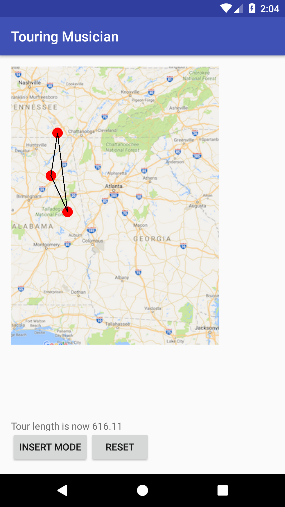
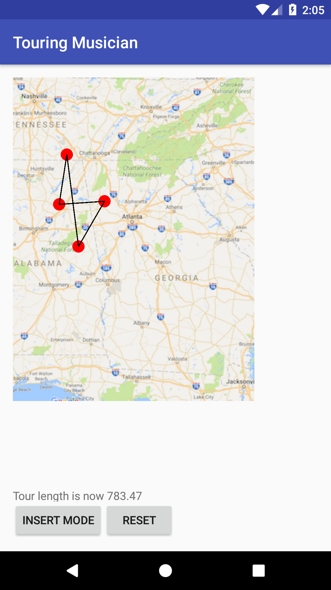
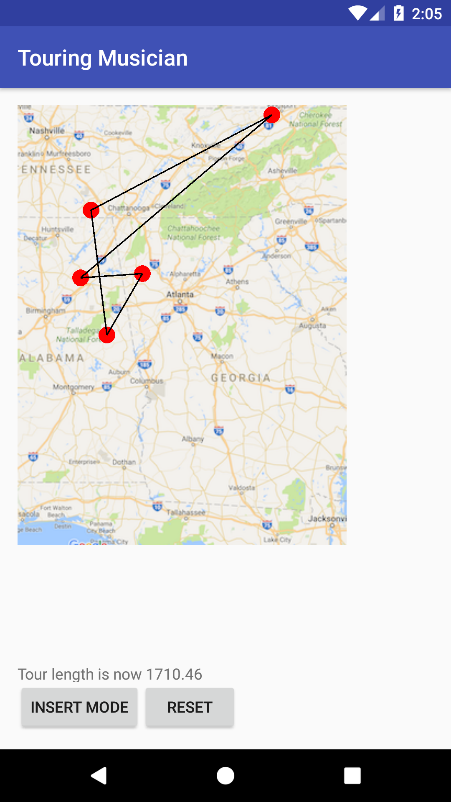

# 🎵 Touring Musician Android App

An interactive Android application that demonstrates the **Traveling Salesman Problem (TSP)** using a circular linked list data structure. Users can tap on a map to add tour stops and visualize different insertion algorithms for route optimization.

## 🎯 What It Does

This app allows users to:
- **Add tour stops** by tapping on an interactive map
- **Visualize routes** with connected lines between stops
- **Compare insertion strategies** for optimizing tour length:
  - **Add**: Simple insertion at the beginning
  - **Closest**: Insert near the closest existing point
  - **Smallest**: Insert at position that minimizes total tour distance

The app implements a **circular linked list** to maintain the tour route and calculates the total distance in real-time as new stops are added.

## 🛠 Tech Stack

| Component | Technology |
|-----------|------------|
| 📱 **Platform** | Android (API 23+) |
| ☕ **Language** | Java |
| 🏗 **Build System** | Gradle |
| 📚 **UI Framework** | AndroidX |
| 🎨 **UI Components** | Material Design Components |
| 🧮 **Algorithm** | Circular Linked List, TSP Heuristics |

## 🚀 Getting Started

### Prerequisites
- Android Studio Arctic Fox or later
- Android SDK API 23 or higher
- Java 8+

### Installation & Running

1. **Clone the repository**
   ```bash
   git clone https://github.com/stabgan/Touring-Musician-Android-App.git
   cd Touring-Musician-Android-App
   ```

2. **Open in Android Studio**
   - Launch Android Studio
   - Select "Open an existing project"
   - Navigate to the cloned directory

3. **Build and Run**
   - Connect an Android device or start an emulator
   - Click the "Run" button or press `Shift + F10`

### Usage

1. **Tap the map** to add tour stops (red circles will appear)
2. **Use the mode selector** to choose insertion strategy:
   - **Add**: Adds stops at the beginning of the tour
   - **Closest**: Inserts near the nearest existing stop
   - **Smallest**: Finds the position that minimizes total distance
3. **Watch the tour length** update in real-time at the bottom
4. **Reset** to clear all stops and start over

## 📸 Screenshots

<div align="center">

| Empty Map | Adding Stops | Optimized Route |
|-----------|--------------|-----------------|
|  |  |  |

</div>

## 🔧 Architecture

### Core Components

- **`MainActivity`**: Main activity handling UI interactions and mode selection
- **`TourMap`**: Custom view that renders the map, tour stops, and routes
- **`CircularLinkedList`**: Data structure implementing TSP insertion algorithms

### Key Algorithms

- **Nearest Insertion**: O(n) - finds closest point and inserts optimally between neighbors
- **Smallest Increase**: O(n²) - tests all positions and chooses the one with minimal distance increase
- **Distance Calculation**: Euclidean distance between 2D points

## 📝 License

```
Copyright 2016 Google Inc.

Licensed under the Apache License, Version 2.0 (the "License");
you may not use this file except in compliance with the License.
You may obtain a copy of the License at

    http://www.apache.org/licenses/LICENSE-2.0

Unless required by applicable law or agreed to in writing, software
distributed under the License is distributed on an "AS IS" BASIS,
WITHOUT WARRANTIES OR CONDITIONS OF ANY KIND, either express or implied.
See the License for the specific language governing permissions and
limitations under the License.
```

---

*Built as part of Google's Applied Digital Skills curriculum for computer science education.*